# Twitter Sentiment Analysis

##### Author: **Suleyman Qayum**


## **Business Understanding**
---

*Gallup*, a global analytics and advice firm, wants to expand its polling capabilities. Currently, the majority of Gallup surveys in the United States are based on interviews conducted by telephones. The company wants to explore the idea of using social media posts to gather opinion data. The company wishes to develop this as an alternative approach mainly due to its efficiency; sentiment data can be obtained in a fraction of the time it takes to interview a sample of the population. Additionally, the high volume of discussion relating to American politics, along with the sheer amount of users on the platform, implies that much larger sample sizes are possible with sentiment data. Finally, results yielded from sentiment analysis can supplement and/or be used to cross-check findings from telephone samples.

> *The company wants to see a demonstration showing that polling via Twitter data is feasible through machine learning, and that it can achieve reasonably accurate results. The demonstration should feature a model that can accurately determine the sentiment of a Tweet based on its content. This model will attempt to determine the current sentiment of the American public towards president Joe Biden. More specifically, they want the model to determine Joe Biden's approval ratings with respect to the American public as a whole (i.e overall public sentiment) and with respect to the populaion of each individual state.


## **Data Understanding**
---
> In this analysis, the *Training Corpus* refers to the collection of tweets from which the the Training and Validation Sets were derived. The *Training Corpus* itself is just a cleaned version of the well-known *Sentiment140* dataset. On the other hand, the *Test Corpus* refers to a collection of tweets, scraped from the Twitter API, that reflect the current public sentiment towards president Joe Biden. Weak labels were applied to the *Test Corpus* using VADER (discussed in the next section) such that it could be used to derive a Test Set.
>
> A set of models were trained on the Training Set, with the Validation Set being used to pick the best among these models. The chosen model was evaluated via two different methods; assessing its performance on the Test Set (with respect to the weak labels), and comparing its predictions on the Test Set to traditional polling data.

### **Training Data**

> *The [Sentiment140](http://help.sentiment140.com/home) dataset will be used to train the classification models. It is a collection of $1,600,000$ tweets, all of which are labelled with a corresponding value indicating sentiment.*

> __The dataset consists of 5 input features and 1 target variable:__
> * __id__ *[int] - unique identifier of the tweet*
> * __date__ *[str] - date the tweet was posted*
> * __user__ *[str] - user that posted the tweet*
> * __text__ *[str] - content of the tweet*
---
> * [Target Variable] __target__ *[str] - label indicating sentiment expressed in the tweet*
>   - __0__ - *negative*
>   - __4__ - *positive*


It is crucial to note that the data in *Sentiment140* is weakly labeled, that is, its labels were generated automatically based on some heuristic. In the technical paper associated with *Sentiment140*, *[Twitter Sentiment Classification using Distant Supervision](https://cs.stanford.edu/people/alecmgo/papers/TwitterDistantSupervision09.pdf)*, this process is summarized:

> "*With the large range of topics discussed on Twitter, it would be very difficult to manually collect enough data to train a sentiment classifier for tweets. Our solution is to use distant supervision, in which our training data consists of tweets with emoticons. The emoticons serve as noisy labels. For example, :) in a tweet indicate that the tweet contains positive sentiment and :( indicates that the tweet contains negative sentiment.*"

The heuristic outlined above was chosen to generate labels because it had previously been shown that emoticons have the potential of being independent of domain, time, and topic [refer to *[Using Emoticons to Reduce Dependency in Machine Learning Techniques for Sentiment Classification](https://aclanthology.org/P05-2008.pdf)* for more details]. At the time when *Sentiment140* was being compiled, this property made emoticons the ideal candidate for such a heuristic. Utilizing such a simple heuristic rule for classifying something as complex as sentiment is bound to produce a substantial number of incorrect labels. Fortunately, there now exists a better alternative to rule-based label generation.

> *__For this analysis, the original labels were discarded, and a new set of labels was generated using the VADER (Valence Aware Dictionary for sEntiment Reasoning) model.__*

> *VADER is a sentiment analysis engine that utilizes a parsimonious lexicon in conjunction with a rule-based model. The following features justify its use as a replacement for rule-based label generation:*
> - *the model relies on a lexicon that is specifically attuned to sentiment in microblog-like contexts (e.g. Twitter)*
> - *the model does not rely on statistical learning to make predictions and therefore does not require training data*
> - *the model is highly accurate -- experimental results show that it predicts the sentiment of tweets with an *F1 Classification Accuracy* of $0.96$ [refer to [VADER: A Parsimonious Rule-based Model for Sentiment Analysis of Social Media Text](http://comp.social.gatech.edu/papers/icwsm14.vader.hutto.pdf) for more details]*

In addition to obtaining more accurate labels, performing sentiment analysis with VADER allowed for the additional classification of tweets that express a neutral sentiment. Although tweets such as these were not considered during the construction of *Sentiment104*, the sheer number of tweets combined with the inaccuracy of the previous labeling method makes it likely that a significant number of neutral tweets are present in the dataset. Thus, for the sake of producing a finer classification model, tweets that were classified as neutral by VADER remained with this label throughout the remainder of this project.

### **Test Data**

> *The **Biden Dataset** is a collection of ~100,000 tweets relating to president Joe Biden, all of which were posted between 07/12/2022 and 07/19/2022.*

The dataset is stored in the database file `tweets.db` located in the `data` subdirectory of this project. The database is comprised of a single table named `tweets`, in which the following data columns are listed:

> * __id__ *[int] - unique identifier of the tweet*
> * __user_id__ *[str] - unique identifier of the user that posted the tweet*
> * __date__ *[str] - date the tweet was posted*
> * __like_count__ *[int] - number of likes associated with the tweet*
> * __user_name__ *[str] - name of the user that posted the tweet*
> * __user_location__ *[str] - location of the user that posted the tweet (optional field)*
> * __text__ *[str] - content of the tweet*

> Among the data columns listed above, __`text`__, __`like_count`__, and __`user_location`__ were the only ones needed to address the business problem described in __Part A__. Therefore, only these data columns were read into memory.

> As was done with the *Sentiment140* dataset, VADER was used to generate labels for the *Biden* dataset.


## **Data Preparation**
---
### **Normalization**

The steps listed below outline the process by which the *Training Corpus* and *Test Corpus* were normalized.

 #### **A. Cleaning**

The first step was cleaning the documents of the corpus. Cleaning the textual data was an involved process comprised of several steps:

 * Replacing accented characters
 * Removing newline characters
 * Removing Twitter handles
 * Removing Twitter hashtags
 * Removing Twitter technical abbreviations
 * Removing web addresses
 * Removing HTML entities
 * Expanding contractions
 * Removing non-alphabetical characters
 * Expanding abbreviated words and phrases

#### **B. Tokenization**

Tokenization was performed using the `TweetTokenizer` from the `nltk` module.

#### **C. Stopword Removal**

Stopwords were loaded from the `data/english_stopwords.txt` file and subsequently removed from all tokenized documents. In addition to stopwords, common names were loaded from the `data/common_names.txt` file and removed from all tokenized documents.

#### **D. Lemmatization**

POS tagging was carried out on each of the tokenized documents. These documents were then lemmatized by passing their tagged tokens into the `WordNetLemmatizer` from the `nltk` module.

### **_Training Corpus_ Statistics**

After the above steps had been applied to the *Training Corpus*, some key statistics were extracted.

#### **Label Frequencies**

The plot below indicates that the *Training Corpus* is an imbalanced dataset, it shows there is roughly twice as many tweets with a `POSITIVE` sentiment than tweets with a `NEUTRAL` or `NEGATIVE` sentiment. Therefore, the sample weights will have to be adjusted accordingly before training any models on this dataset.


<center>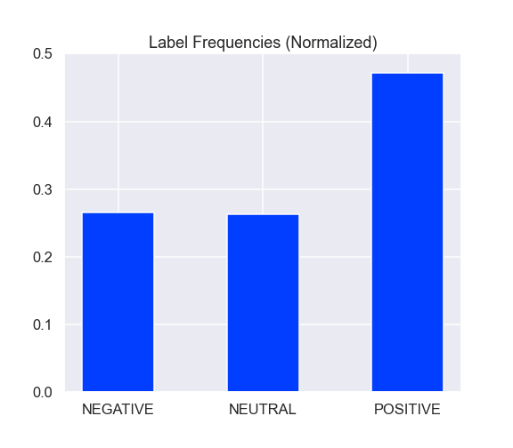</center>


#### **Average Length of Tokenized Document**

The average length of the normalized *Training Corpus* was $4.43\ \text{tokens}/\text{document}$, which implies a relatively small number of tokens, on average, made it through the text normalization process. Since there was only, on average, $4$-$5$ tokens per normalized tweet, collecting $N$-grams larger than unigrams isn't likely to provide much additional benefit. For this reason, only unigrams were considered during the vectorization process.


#### **Document Frequencies by Label**

The plots below list the top 30 most frequently occurring words for each sentiment label in the *Training Corpus*. Note that the ***document frequency*** of a certain word refers to the number of documents (i.e. tweets) in the corpus containing that word.


<center>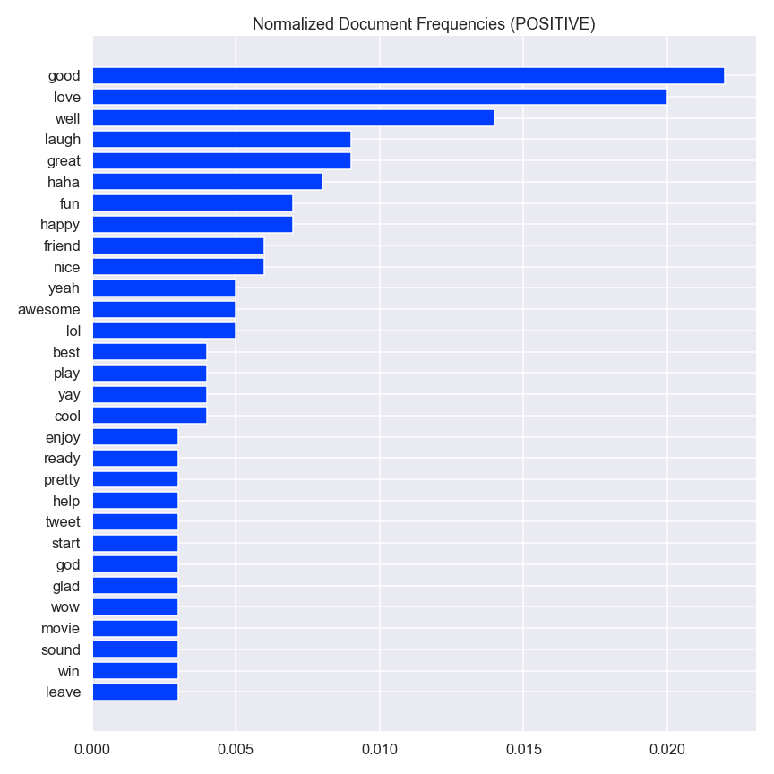</center>


<center>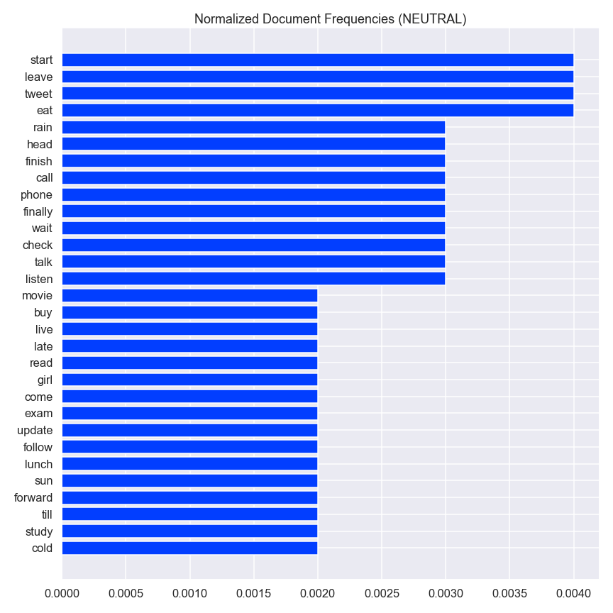</center>


<center>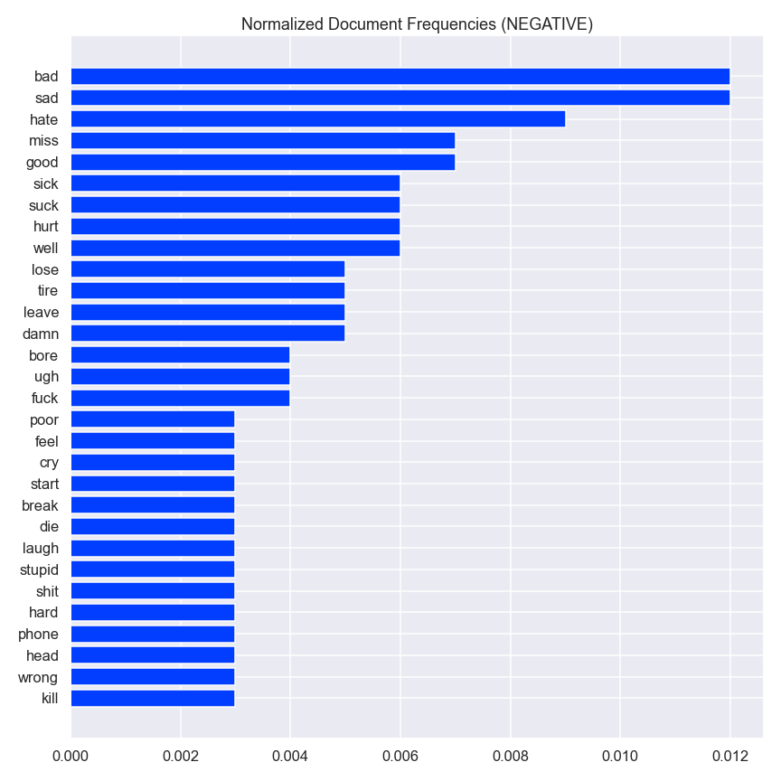</center>


The figures above indicate that:

* words such as __`good`__, __`love`__, __`well`__, and __`laugh`__ are more prevalent in tweets with a __`POSITIVE`__ sentiment
* words such as __`start`__, __`leave`__, __`eat`__, and __`rain`__ are more prevalent in tweets with a __`NEUTRAL`__ sentiment
* words such as __`bad`__, __`sad`__, __`hate`__, and __`miss`__ are more prevalent in tweets with a __`NEGATIVE`__ sentiment

As these words would typically be associated with those sentiments, the plots confirm that the *Training Corpus* was indeed labeled accurately, and therefore is suitable for use as training data.

### **Preprocessing the _Test Corpus_**

Users on Twitter are not required to disclose any type of location data in their profile, which essentially meant that the `user_location` column consisted of freeform text input. The `parse_state_from_location` function was created to solve this issue - it uses regular expressions to scan a piece of unstructured text for any mention of one of the $50$ American states. This function was applied to the `user_location` column of the *Training Corpus*.

It was assumed that the number of likes associated with a tweet is equivalent to the number of other Twitter users who agree with the sentiment of that tweet. Therefore, the `sentiment_multiplier` column was created to reflect this.

For a tweet with $N_L$ likes, the sentiment multiplier ($N_S$) corresponds to the aggregate of the author's sentiment and the $N_L$ other users who agreed with that sentiment by liking the author's tweet. Mathematically, this is given by the following equation:
$$ N_S = N_L+1 $$

> **_It is important to note that values in the `sentiment_multiplier` column were only used when calculating the overall approval rating, that is, they were omitted when calculating approval ratings by state. The reason being that the locations of the users who liked a specific tweet were not known._**

### **Extracting the Training, Validation, and Test Sets**

The *Test Corpus* was randomly split into the Training Set and Validation Set, with these datasets containing $80\%$ and $20\%$ of the training documents respectively. The Test Set was created from the documents in the *Test Corpus*.

### **Vectorization**

The number of features used during the vectorization process was $15,000$. Only unigrams were considered. The Training, Validation, and Test Sets were vectorized via the `sklearn.CountVectorizer` transformer and `tensorflow.keras.layers.TextVectorization` layer. The `sklearn.CountVectorizer` transformer was fitted to the Training Set and then used to transform the Training, Validation, and Test Set into a matrix of token counts (i.e. Bag of Words). The `tensorflow.keras.layers.TextVectorization` layer was adapted to the Training Set and then used to transform the Training, Validation, and Test Set into a collection of 1-dimensional tensors comprised of integer encoded tokens.


## **Modeling**
---

### **Scoring**

Since over-representing sentiment (high false positive rate) and under-representing sentiment (high false negative rate) are both equally undesirable, the $F_1\text{-Score}$ was the primary metric by which the models were evaluated. This score takes into account both recall ($R$) and precision ($P$) - if one of these metrics suffers, it will be reflected in the $F_1\text{-Score}$.

The formula for the $F_1\text{-Score}$ is:
> $$ F_1 = 2(\dfrac{1}{R} + \dfrac{1}{P})$$

### **Models**

Sentiment classification was performed using the following models:

- `Multinomial Naive Bayes`
- `Random Forest`
- `Logistic Regression`
- `Recurrent Neural Network (RNN)`

### **Results**

#### ***`Multinomial Naive Bayes`***

The performances of the `Naive Bayes` model on the Training Set and Validation Set are compared in the plots below:

<center></center>


<center>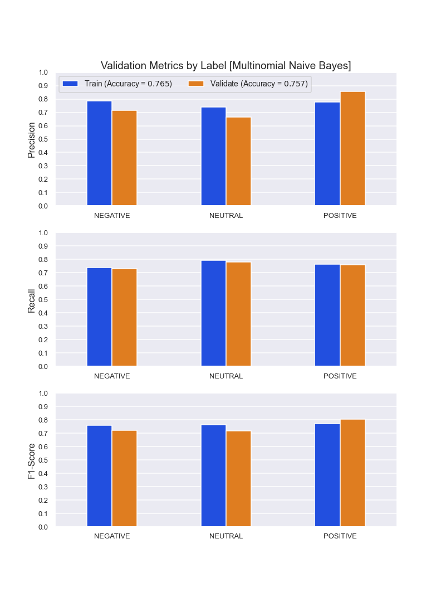</center>


The scores of the `Naive Bayes` model on the Validation Set are listed in the table below:

<center>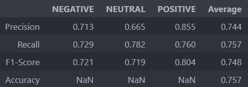</center>


The validation performance of the `Naive Bayes` model is summarized below:

> - Adequate recall when classifying POSITIVE tweets:
>   - $76\%$ of all POSITIVE tweets in the Validation Set were labeled correctly
> - Very good precision when classifying POSITIVE tweets:
>   - $86\%$ of all POSITIVE predictions made by the model were correct
> - Good overall performance on the POSITIVE tweets $(F_{1, \text{POSITIVE}} = 0.804)$
---
> - Adequate recall when classifying NEUTRAL tweets:
>   - $78\%$ of all NEUTRAL tweets in the Validation Set were labeled correctly
> - Poor precision when classifying NEUTRAL tweets:
>   - $67\%$ of all NEUTRAL predictions made by the model were correct
> - Adequate overall performance on the NEUTRAL tweets $(F_{1, \text{NEUTRAL}} = 0.719)$
---
> - Adequate recall when classifying NEGATIVE tweets:
>   - $73\%$ of all NEGATIVE tweets in the Validation Set were labeled correctly
> - Adequate precision when classifying NEGATIVE tweets:
>   - $71\%$ of all NEGATIVE predictions made by the model were correct
> - Poor overall performance on the NEGATIVE tweets $(F_{1, \text{NEGATIVE}} = 0.721)$
---
> - Overall, the model performed performance was slightly Adequate $(F_{1,\text{avg}} = 0.748)$
> - The model generalized well to the validation data:
>   - $0.8\%$ loss in accuracy indicates only slight overfitting


#### ***`Random Forest`***

The performances of the `Random Forest` model on the Training Set and Validation Set are compared in the plots below:

<center>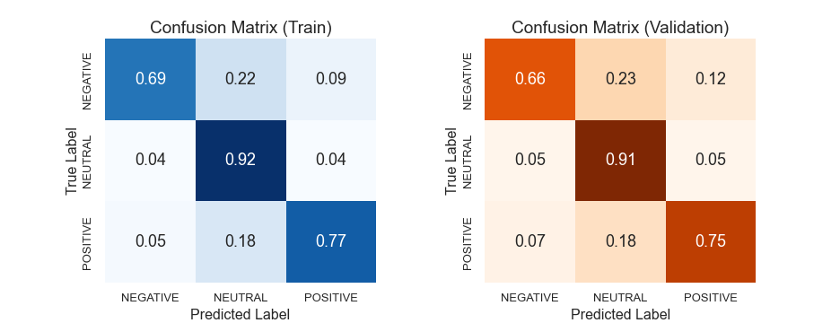</center>


<center>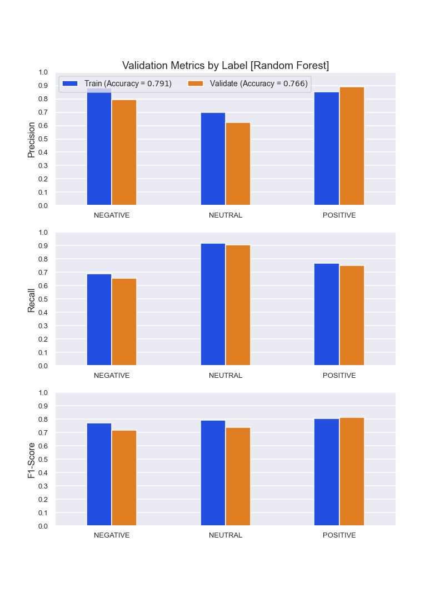</center>


The scores of the `Random Forest` model on the Validation Set are listed in the table below:

<center>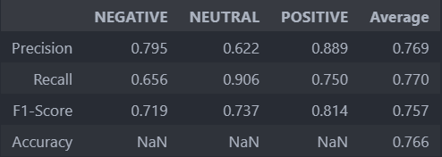</center>


The validation performance of the `Random Forest` model is summarized below:

> - Adequate recall when classifying POSITIVE tweets:
>   - $75\%$ of all POSITIVE tweets in the Validation Set were labeled correctly
> - Very good precision when classifying POSITIVE tweets:
>   - $89\%$ of all POSITIVE predictions made by the model were correct
> - Good overall performance on the POSITIVE tweets $(F_{1, \text{POSITIVE}} = 0.814)$
---
> - Excellent recall when classifying NEUTRAL tweets:
>   - $91\%$ of all NEUTRAL tweets in the Validation Set were labeled correctly
> - Poor precision when classifying NEUTRAL tweets:
>   - $67\%$ of all NEUTRAL predictions made by the model were correct
> - Adequate overall performance on the NEUTRAL tweets $(F_{1, \text{NEUTRAL}} = 0.737)$
---
> - Poor recall when classifying NEGATIVE tweets:
>   - $66\%$ of all NEGATIVE tweets in the Validation Set were labeled correctly
> - Good precision when classifying NEGATIVE tweets:
>   - $80\%$ of all NEGATIVE predictions made by the model were correct
> - Adequate overall performance on the NEGATIVE tweets $(F_{1, \text{NEGATIVE}} = 0.719)$
---
> - Overall, the model's performance was Adequate $(F_{1,\text{avg}} = 0.757)$
> - The model's ability to generalize to the validation data needs some improvement:
>   - $2.5\%$ loss in accuracy indicates some overfitting

#### ***`Logistic Regression`***

The performances of the `Logistic Regression` model on the Training Set and Validation Set are compared in the plots below:

<center>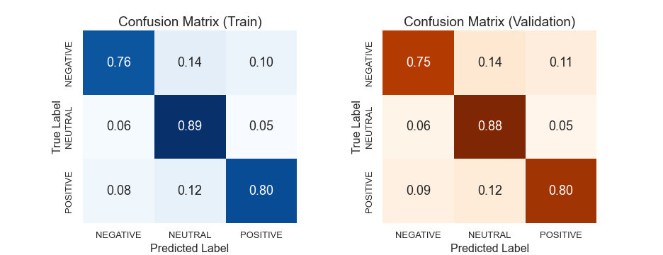</center>


<center>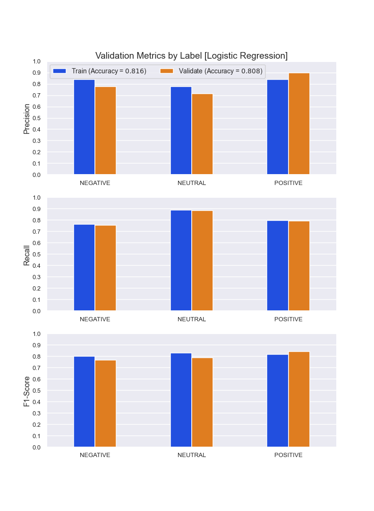</center>


The scores of the `Logistic Regression` model on the Validation Set are listed in the table below:

<center>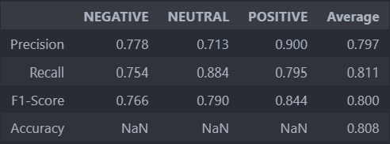</center>


The validation performance of the `Logistic Regression` model is summarized below:

> - Good recall when classifying POSITIVE tweets:
>   - $80\%$ of POSITIVE tweets in the Validation Set were labeled correctly
> - Excellent precision when classifying POSITIVE tweets:
>   - $90\%$ of all POSITIVE predictions made by the model were actually POSITIVE
> - Good overall performance on the POSITIVE tweets $(F_{1, \text{POSITIVE}} = 0.844)$
---
> - Very good recall when classifying NEUTRAL tweets:
>   - $88\%$ of NEUTRAL tweets in the Validation Set were labeled correctly
> - Adequate precision when classifying NEUTRAL tweets:
>   - $71\%$ of all NEUTRAL predictions made by the model were correct
> - Decent overall performance on the NEUTRAL tweets $(F_{1, \text{NEUTRAL}} = 0.790)$
---
> - Adequate recall when classifying NEGATIVE tweets:
>   - $75\%$ of NEGATIVE tweets in the Validation Set were labeled correctly
> - Adequate precision when classifying NEGATIVE tweets:
>   - $78\%$ of all NEGATIVE predictions made by the model were correct
> - Adequate overall performance on the NEGATIVE tweets $(F_{1, \text{NEGATIVE}} = 0.766)$
---
> - Overall, the model's performance was good $(F_{1,\text{avg}} = 0.800)$
> - The model generalized well to the validation data:
>   - $0.8\%$ loss in accuracy indicates only slight overfitting

#### ***`Recurrent Neural Network (RNN)`***

A series of $5$ Recurrent Neural Networks (`RNN 1`, `RNN 2`, `RNN 3`, `RNN 4`, and `RNN 5`), containing one or more bidirectional LSTM layers, were trained on the Training Set. These models were validated against the Validation Set after every training epoch. After each of the $5$ training processes had been completed, the epoch in which the lowest cross-entropy loss on the Validation Set ocurred was determined and the model parameters chosen accordingly.

For each successive RNN after *RNN 1*, the number of neurons per LSTM layer and/or the number of bidirectional LSTM layers was increased until overfitting started to negate improvements in the validation $F_1\text{-Score}$. At this point, the RNN showing the highest $F_1\text{-Score}$ on the Validation Set was chosen to be compared against the previously discussed `Naive Bayes`, `Random Forest`, and `Logistic Regression` models.

The model architectures for all $5$ RNN's are shown below:

##### <center> `RNN 1` </center>

<center>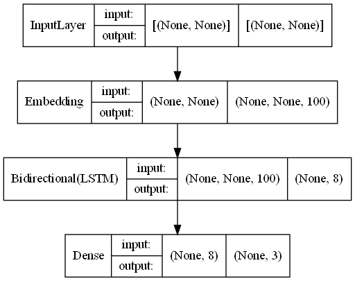</center>


##### <center> `RNN 2` </center>

<center>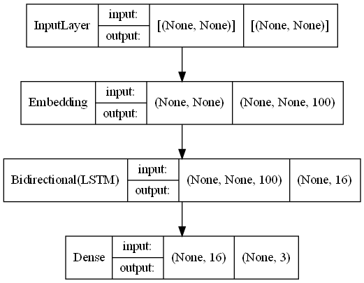</center>


##### <center> `RNN 3` </center>

<center></center>


##### <center> `RNN 4` </center>

<center>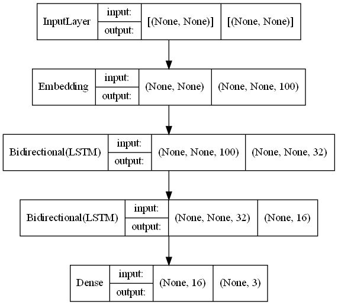</center>


##### <center> `RNN 5` </center>

<center>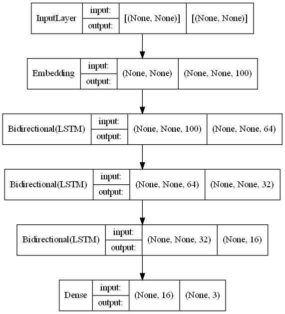</center>


The average validation metrics for `RNN 1`, `RNN 2`, `RNN 3`, `RNN 4`, and `RNN 5` are listed in the table below:


<center>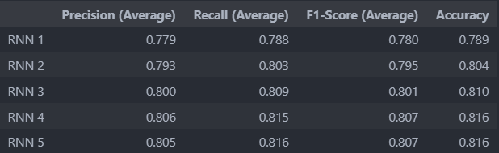</center>


A plot of the average $F_1\text{-Score}$ on the Validation Set for `RNN 1`, `RNN 2`, `RNN 3`, `RNN 4`, and `RNN 5` is shown below:

<center>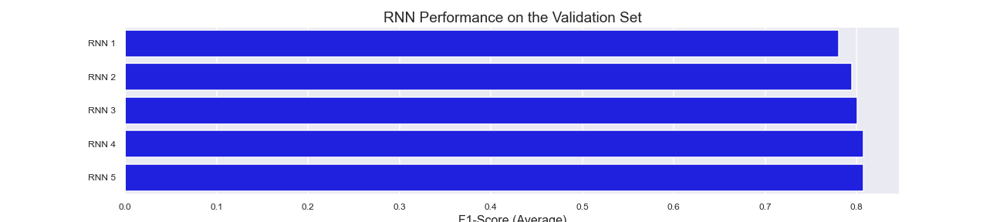</center>


The above two figures show that `RNN 4` and `RNN 5` achieved almost identical scores on the Validation Set, despite the fact that `RNN 5` had an additional bidirectional LSTM layer containing $32$ neurons. `RNN 4` was chosen as the final RNN because its simpler architecture means that it is computationally faster and has less variance (and therefore a better ability to generalize to unseen data) than `RNN 5`.

The performances of the `RNN 4` model on the Training Set and Validation Set are compared in the plots below:

<center>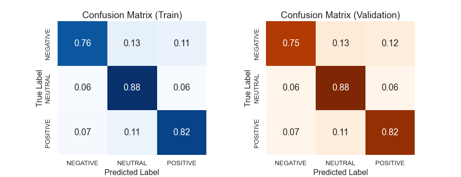</center>


<center>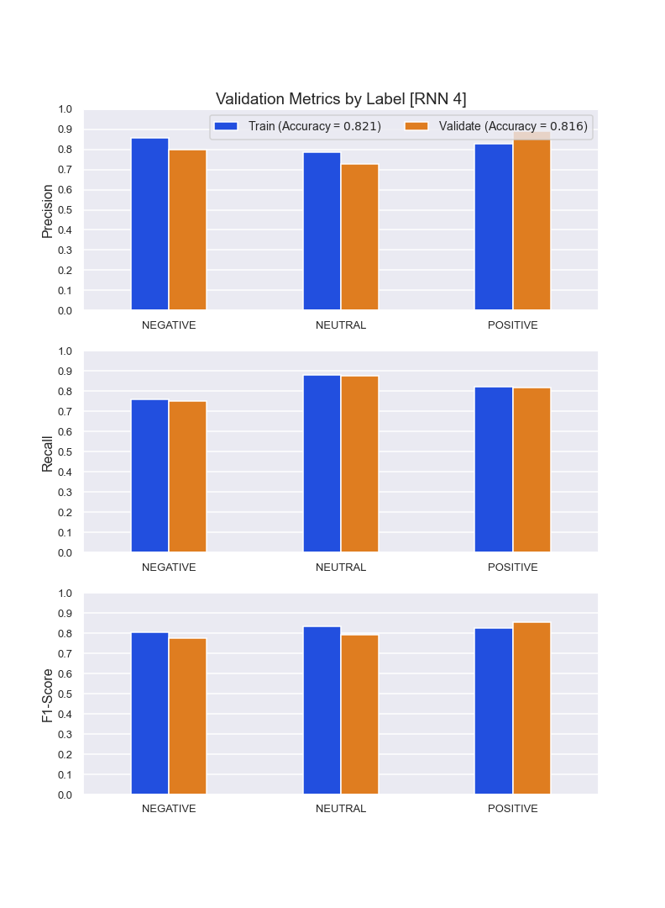</center>


The scores of the `RNN 4` model on the Validation Set are listed in the table below:

<center>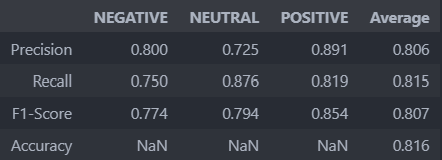</center>


The validation performance of the `RNN 4` model is summarized below:

> - Good recall when classifying POSITIVE tweets:
>   - $82\%$ of POSITIVE tweets in the Validation Set were labeled correctly
> - Very good precision when classifying POSITIVE tweets:
>   - $89\%$ of all POSITIVE predictions made by the model were actually POSITIVE
> - Very good overall performance on the POSITIVE tweets $(F_{1, \text{POSITIVE}} = 0.854)$
---
> - Very good recall when classifying NEUTRAL tweets:
>   - $88\%$ of NEUTRAL tweets in the Validation Set were labeled correctly
> - Adequate precision when classifying NEUTRAL tweets:
>   - $73\%$ of all NEUTRAL predictions made by the model were correct
> - Adequate overall performance on the NEUTRAL tweets $(F_{1, \text{NEUTRAL}} = 0.794)$
---
> - Adequate recall when classifying NEGATIVE tweets:
>   - $75\%$ labeled correctly
> - Good precision when classifying NEGATIVE tweets:
>   - $80\%$ of all NEGATIVE predictions made by the model were correct
> - Adequate overall performance on the NEGATIVE tweets $(F_{1, \text{NEGATIVE}} = 0.774)$
---
> - Overall, the model's performance was good $(F_{1,\text{avg}} = 0.807)$
> - The model generalized well to the validation data:
>   - $0.5\%$ loss in accuracy indicates only slight overfitting


The validation metrics by label, validation confusion matrices, and the validation scores in tabular form can be found in the following directories:

```
├── images
    ├── rnn1
    ├── rnn2
    ├── rnn3
    ├── rnn4
    └── rnn5
```


### **Selecting the Best Model**

The average validation metrics for the `Naive Bayes`, `Random Forest`, `Logistic Regression`, and `RNN 4` models are listed in the table below:


<center>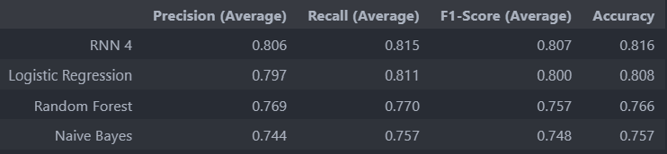</center>


A plot of the average $F_1\text{-Score}$ on the Validation Set for the `Naive Bayes`, `Random Forest`, `Logistic Regression`, and `RNN 4` models is shown below:


<center>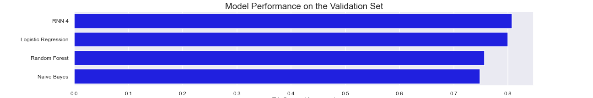</center>


> The two figures above show that `RNN 4` had the highest $F_1\text{-Score}$ and $\text{Accuracy}$ on the Validation Set, and therefore was chosen as the best model. A final evaluation of this model was carried out by assessing its performance on the Test Set.


## **Evaluation**
---

### **Evaluating the Performance of `RNN 4` on the Test Set**

The performances of the `RNN 4` model on the Training Set and Test Set are compared in the plots below:

<center>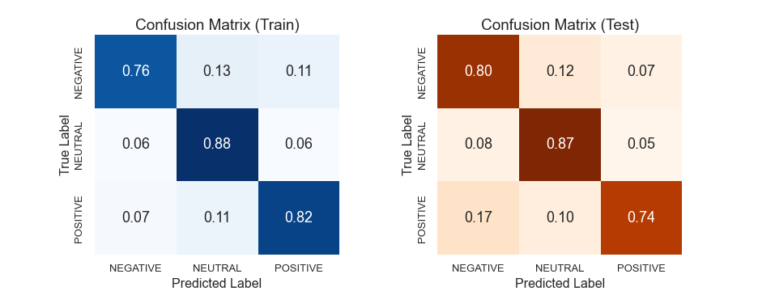</center>


<center>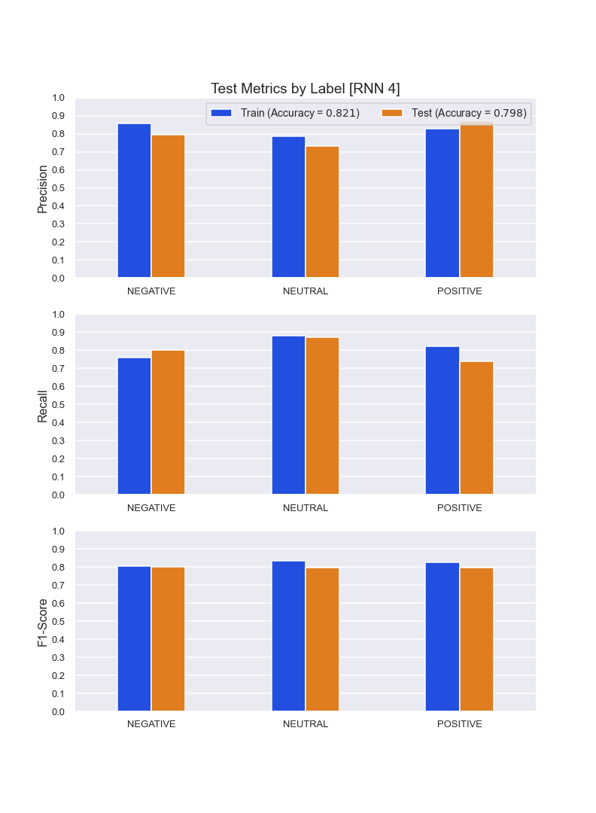</center>


The scores achieved by the `RNN 4` model on the Test Set are listed fully in the table below:

<center>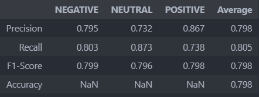</center>


The performance of the `RNN 4` model on the Test Set is summarized as follows:

> - Adequate recall when classifying POSITIVE tweets:
>   - $74\%$ of all POSITIVE tweets in the Test Set were labeled correctly
> - Very good precision when classifying POSITIVE tweets:
>   - $87\%$ of all POSITIVE predictions made by the model were correct
> - Good overall performance on the POSITIVE tweets $(F_{1, \text{POSITIVE}} = 0.798)$
---
> - Very good recall when classifying NEUTRAL tweets:
>   - $87\%$ of all NEUTRAL tweets in the Test Set were labeled correctly
> - Adequate precision when classifying NEUTRAL tweets:
>   - $73\%$ of all NEUTRAL predictions made by the model were correct
> - Good overall performance on the NEUTRAL tweets $(F_{1, \text{NEUTRAL}} = 0.796)$
---
> - Good recall when classifying NEGATIVE tweets:
>   - $80\%$ of all NEGATIVE tweets in the Test Set were labeled correctly
> - Good precision when classifying NEGATIVE tweets:
>   - $80\%$ of all NEGATIVE predictions made by the model were correct
> - Good overall performance on the NEGATIVE tweets $(F_{1, \text{NEGATIVE}} = 0.799)$
---
> - Overall, the model had a solid performance on the Test Set:
>   - $F_{1,\text{avg}} = 0.798$
> - The model's ability to generalize to unseen data needs some improvement:
>   - $2.3\%$ loss in accuracy indicates some overfitting


### **Comparing the Approval Ratings Predicted by `RNN 4` with Traditional Polling Data**

In order to calculate approval ratings based on Twitter sentiment data, all `NEUTRAL` tweets were discarded. This was done for the following reasons:
 * a `NEUTRAL` tweet does not necessarily mean that the author has no opinion towards Joe Biden, whereas it is reasonable to assume that a tweet with a `POSITIVE`/`NEGATIVE` sentiment corresponds with the author's overall attitude towards the president
 * a significant number of `NEUTRAL` tweets in the *Test Corpus* were some kind of news outlet reporting on a situation involving Joe Biden, as opposed to an individual expressing their views, and so were not valid as polling data

> Given some collection of sentiment data containing $N_{P}$ `POSITIVE` labels and $N_{N}$ `NEGATIVE` labels, the associated **approval rating** and **disapproval rating** were determined from the following formulas:
> $$ \text{Approval\ Rating} = (\dfrac{N_{P}}{N_{P} + N_{N}}) * 100\% $$
> $$ \text{Disapproval\ Rating} = (\dfrac{N_{N}}{N_{P} + N_{N}}) * 100\% $$

#### **Overall Approval Ratings**

All of the approval ratings were gathered from a project that tracks Joe Biden's approval rating in real time.[^1] The project was created and is currently maintained by [*FiveThirtyEight*](https://fivethirtyeight.com), a journalism website that uses data driven analytics to make predictions about politics, economics, and sports in the United States. The webpage hosting the project contains a constantly updated aggregate of opinion polls sourced from a myriad of different organizations and research groups.  All polls chosen ocurred within, or over a period of time overlapping, the same week within which all tweets in the *Test Corpus* were created (July 12, 2022 - July 19, 2022). The approval ratings from $10$ of these polls were collected and compared to the results predicted by `RNN 4`, as shown in the plots below:


<center>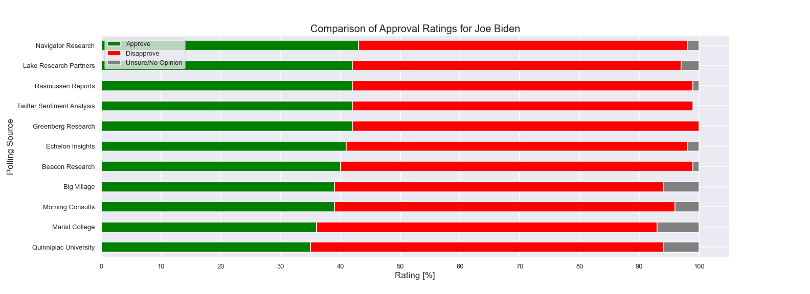</center>


<center>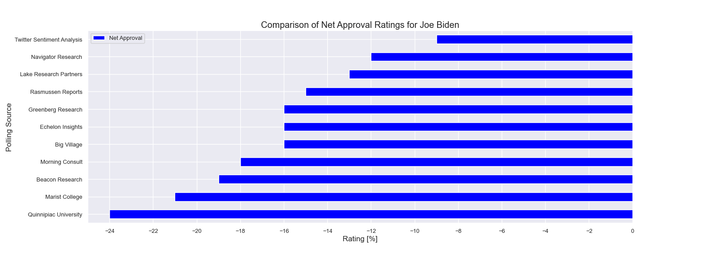</center>


> The figures above suggest that the `RNN 4` model was biased; it overestimated Biden's approval rating compared to all $10$ sets of polling data. However, the model shows some potential; for $7$ out of $10$ sets of polling data, `RNN` predicted a net approval rating differed by $10\%$ or less, indicating that the bias is not large.

There is evidence suggesting that Twitter users in the United States are more likely to be Democrats than the general public[^2], which would explain  why `RNN 4` was biased towards overestimating Joe Biden's approval rating.

#### **State Approval Ratings**

The __net approval ratings__ for each state were sourced from the political forecasting website [*RacetotheWH*](https://www.racetothewh.com), using data gathered from a webpage that tracks Joe Biden's approval ratings in each state by aggregating a variety of opinion polls.[^3] For each of the $50$ states, a poll conducted during the same the *Test Corpus* was compiled (July 12, 2022 - July 19, 2022) was chosen. If a poll with such a date was not present, than the poll with closest associated date was chosen. **It should be noted that some of the smaller states had relatively few polls listed, which at times necessitated choosing a poll that had been conducted weeks before or after the time during which the *Test Corpus* was compiled.**

The two maps below illustrate the net approval rating by state, as predicted by `RNN 4` and traditional polling data:


<center>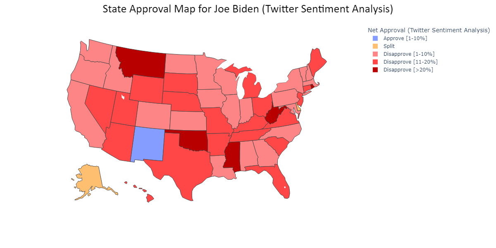</center>


<center>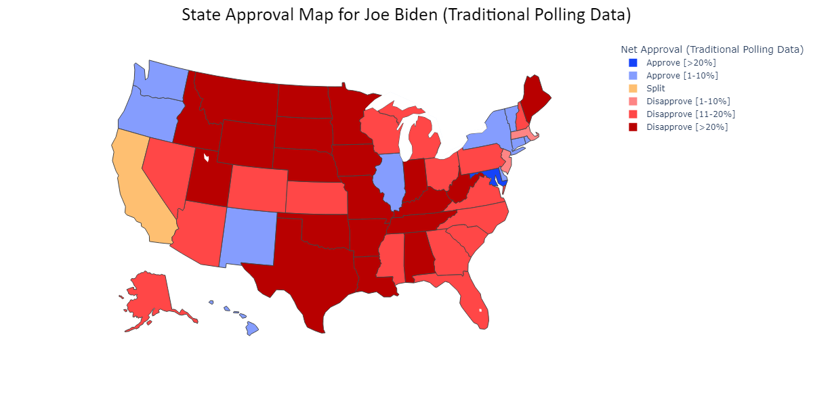</center>


The following map shows how the predictions made by `RNN 4` deviated from each state's polling data. **Red** means that state polls indicate a **lower net approval rate** than `RNN4`, while **Blue** means that state polls indicate a **higher net approval rate** than`RNN4`.

<center>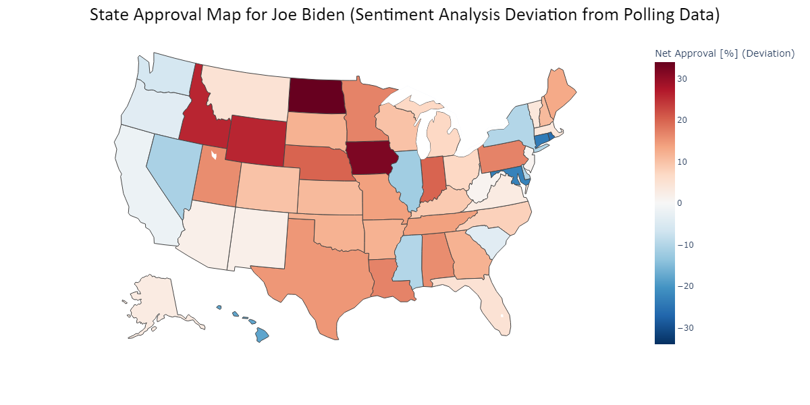</center>


> The `RNN 4` model predicted statewide net approval ratings surprisingly well, considering that, on average, there were only about $435$ labeled observations per state. Its predictions deviated from polling data by $10\%$ or less in $27$ states, and by $15\%$ or less in $37$ states.

The figure above highlights that `RNN 4` had a far greater tendency to overestimate the net approval rate in a given state. This discrepency is most notable in the political region known as the *Heartland/New South Alliance*, comprised of the American Heartland and New South regions.[^4] The states comprising this political region are:

* __American Heartland:__ North Dakota, South Dakota, Nebraska, Kansas, Oklahoma, Texas, Montana, Arizona, Colorado, Idaho, Wyoming, Utah, Nevada, New Mexico, Alaska

* __New South:__ North Carolina, South Carolina, Georgia, Florida, Tennessee, Alabama, Mississippi, Arkansas, Louisiana

With the exception of New Mexico, Arizona, Nevada, and Mississippi, all of the states in the *Heartland/New South Alliance* were predicted to have higher approval rates than what was suggested by the polling data. The states in the *Heartland/New South Alliance* characterized as such because they are more conservative than the rest of the country, and thus a liberal Democrat such as Joe Biden is likely to have a low approval rating by the general public residing in this region. This fact means it is likely the polling data is more accurate, which, in turn, means that the `RNN 4` model is biased towards higher approval ratings (lower disapproval ratings) in this region. This, most likely, implies that there was an insufficient number tweets from these states, which resulted in skewed datasets not accurately reflecting the opinions of the general population. In addition, if `RNN4` is biased towards overestimating Biden's overall approval rate, then this same bias will affect its predictions on the state level.


## **Limitations**
---

#### **Rate Limits Imposed by the Twitter API**

There is a limit to the number of requests one can make to the Twitter API in a single month. The number of requests that can be made per $15$ minute window is also limited. These rules greatly hinder the quantity of data that can be collected, especially when time is of the essence.

#### **Issues Pertaining to the Location Data**

Instead of parsing text input from a user's profile, it is possible to retrieve tweets that are tagged with geolocation data. Geolocation data is ideal because it is unambiguous and precise. The unstructured user input used in this analysis, however, was extremely ambiguous and could only provide a coarse approximation of a tweet's location. In fact, the location could not be determined for around $70\%$ of tweets in the *Test Corpus*.


## **Future Work**
---

#### **Fine-Grained Sentiment Analysis**

Polarity can be categorized with greater precision. In the realm of politics, the degree of polarization is as important as polarity itself. As an example, consider the benefit of being able to use sentiment analysis to discern between hardline Republicans/Democrats versus their more moderate counterparts. Therefore it would be prudent to expand the categories of polarity. For example, a model could be trained to classify sentiment under the following polarities:
- *Very Positive*
- *Positive*
- *Neutral*
- *Negative*
- *Very Negative*

The upside of this approach is that powerful rule-based sentiment analyzers (e.g. VADER) are readily available for use in generating weakly-labeled data with finer grain polarity.


#### **Emotion Detection**

Sentiment can also be categorized with greater precision. A better approach to surveying public sentiment would be to train a model to detect the emotions, rather than the general sentiment, expressed in a tweet. With respect to the political arena, this would provide invaluable information because it would allow trends in sentiment to be broken

The downside of using natural language processing to classify emotions is that the meaning of individual words/phrases becomes more context-specific, and therefore, harder to classify. For example, some words that typically express anger, like "*bad*" or "*kill*", in one context (e.g. "*your product is so bad*" or "*your customer support is killing me*")  might also express happiness in some other context (e.g. "*this is bad ass*" or "*you're killing it*").


#### **Identification of Domain-Specific Tweets**

Training a model to classify the sentiment of tweets, without regarding topic, results in the model having to utilize a very large vocabulary. If limited to a particular domain (American politics in this case), it is likely the model will perform better. Therefore, more emphasis needs to be placed on gathering tweets with content related to American politics. Alternatively, a separate model can be trained to specifically identify such tweets.


#### **Utilizing Emoticon Data**

As discussed in *Part B*, the tweets that comprise the *Sentiment104* dataset had their emoticons stripped from them before being incorporated into the dataset. This leads to a significant shortcoming in our model, namely, that it does not account for emoticons when determining sentiment. This needs to be addressed because the emoticon feature is very informative when it comes to sentiment, especially with regard to Twitter data. This can easily be achieved by collecting a new set of tweets from the Twitter API, and adjusting text pre-processing such that emoticons are identified and kept as tokens before special characters are removed in general.


## **Further Information**
---

Review the full analysis in the [Jupyter Notebook](./twitter-sentiment-analysis.ipynb) or the view the [Presentation](./Twitter_Sentiment_Analysis.pdf).

*For any additional questions, please contact:*

> **Suleyman Qayum (sqayum33@gmail.com)**


## **Repository Structure**
---

```
├── data
      ├── common_names.txt
      ├── english_stopwords.txt
      ├── glove.twitter.27B.100d.txt
      ├── sentiment140.csv
      ├── tweets.db
      ├── us_cities.csv
      └── us_states.csv
├── images
      ├── logreg
            ├── validation-confusion-matrices.png
            ├── validation-curve.png
            ├── validation-metrics-by-label.png
            └── validation-metrics-df.png
      ├── mnb
            ├── validation-confusion-matrices.png
            ├── validation-metrics-by-label.png
            └── validation-metrics-df.png
      ├── overall-metrics
            ├── average-validation-metrics-df.png
            ├── f1-scores.png
            ├── rnn-average-validation-metrics-df.png
            └── rnn-f1-scores.png
      ├── rfc
            ├── max-depth-validation-curve.png
            ├── max-features-validation-curve.png
            ├── validation-confusion-matrices.png
            ├── validation-metrics-by-label.png
            └── validation-metrics-df.png
      ├── rnn1
            ├── history.png
            ├── plot.png
            ├── validation-confusion-matrices.png
            ├── validation-metrics-by-label.png
            └── validation-metrics-df.png
      ├── rnn2
            ├── history.png
            ├── plot.png
            ├── validation-confusion-matrices.png
            ├── validation-metrics-by-label.png
            └── validation-metrics-df.png
      ├── rnn3
            ├── history.png
            ├── plot.png
            ├── validation-confusion-matrices.png
            ├── validation-metrics-by-label.png
            └── validation-metrics-df.png
      ├── rnn4
            ├── history.png
            ├── plot.png
            ├── test-confusion-matrices.png
            ├── test-metrics-by-label.png
            ├── test-metrics-df.png
            ├── validation-confusion-matrices.png
            ├── validation-metrics-by-label.png
            └── validation-metrics-df.png
      ├── rnn5
            ├── history.png
            ├── plot.png
            ├── validation-confusion-matrices.png
            ├── validation-metrics-by-label.png
            └── validation-metrics-df.png
      ├── training-corpus-statistics
            ├── NEGATIVE-document-frequencies.png
            ├── NEUTRAL-document-frequencies.png
            ├── POSITIVE-document-frequencies.png
            └── training-label-frequencies.png
      ├── approval-ratings.png
      ├── net-approval-ratings.png
      ├── state-approval-map-from-deviation.png
      ├── state-approval-map-from-polling-data.png
      └── state-approval-map-from-sentiment-data.png
├── models
      ├── rnn1.h5
      ├── rnn2.h5
      ├── rnn3.h5
      ├── rnn4.h5
      └── rnn5.h5
├── nlp_utils.py
├── README.md
├── README.pdf
├── twitter_api_access.py
├── Twitter_Sentiment_Analysis.pdf
└── twitter-sentiment-analysis.ipynb
```


[^1]: Silver, N. (2021, January 23). *How popular is Joe Biden?* FiveThirtyEight. Retrieved August 5, 2022, from https://projects.fivethirtyeight.com/biden-approval-rating/

[^2]: Hughes, A., &  Wojcik, S. (2019, April 24). *How Twitter Users Compare to the General Public*. Pew Research Center: Internet, Science & Tech. https://www.pewresearch.org/internet/2019/04/24/sizing-up-twitter-users/

[^3]: Phillips, L. (n.d.). *How popular is Joe Biden?* Race to the WH. Retrieved September 6, 2022, from https://www.racetothewh.com/biden

[^4]: Tarrance, L. (2018, June 25). *A New Regional Paradigm for Following U.S. Elections*. Gallup.Com. https://news.gallup.com/opinion/polling-matters/235838/new-regional-paradigm-following-elections.aspx
