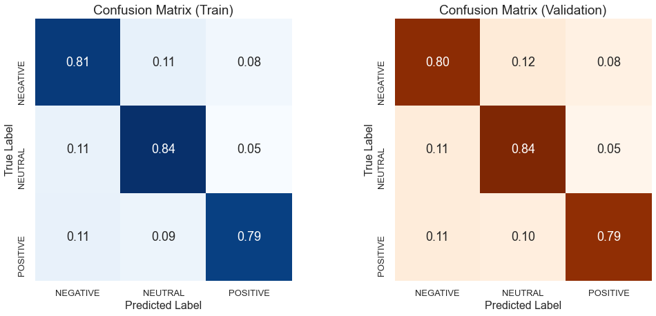
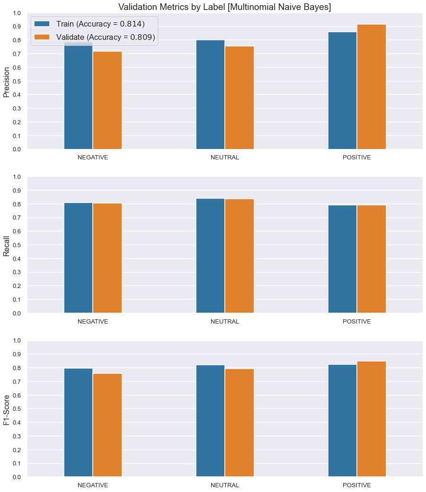
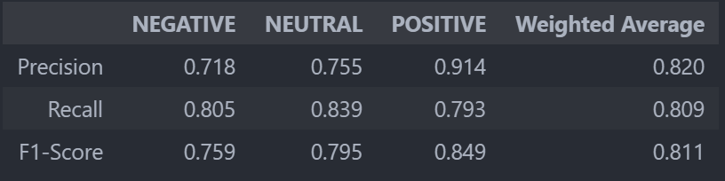
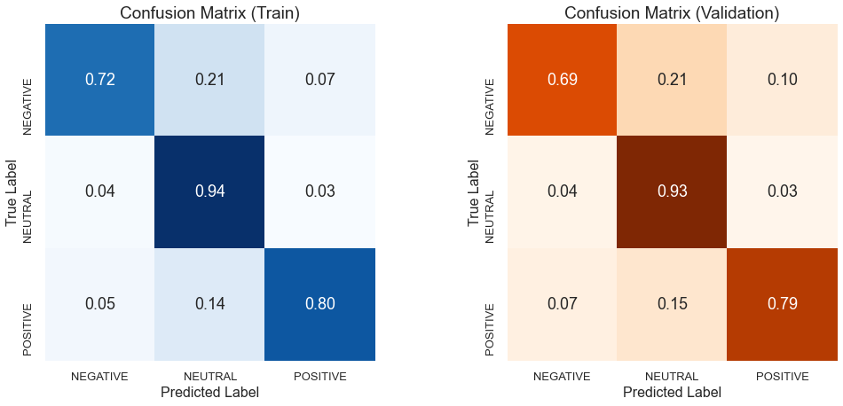
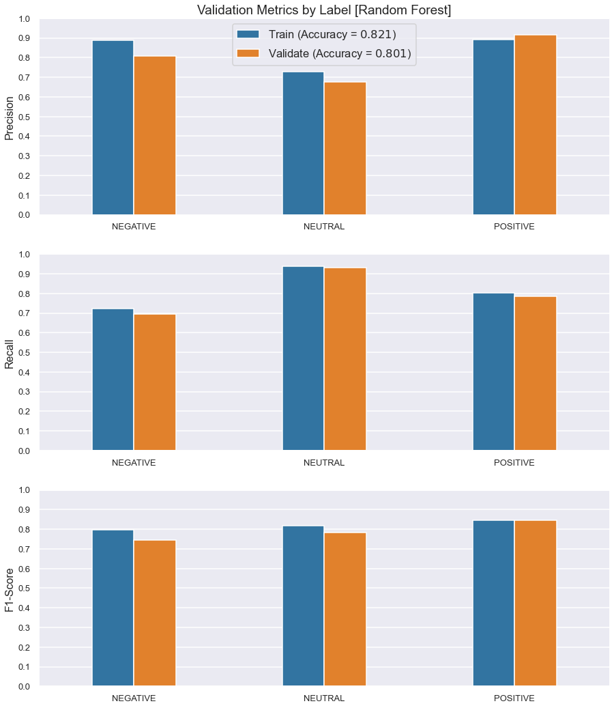
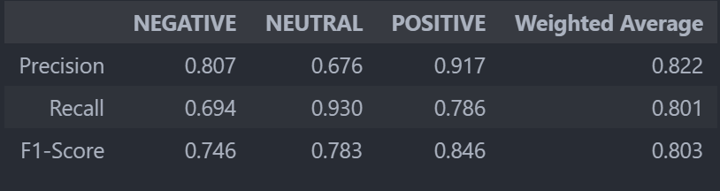
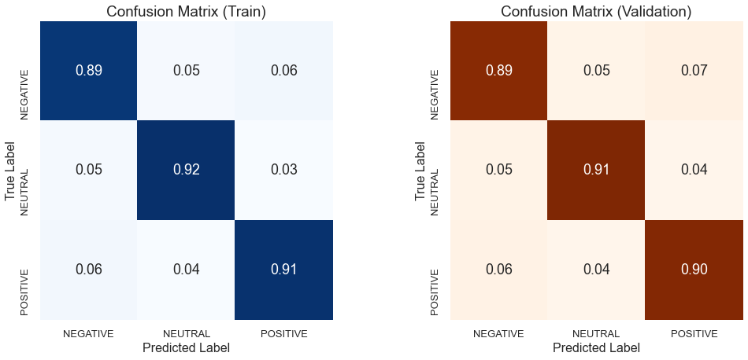
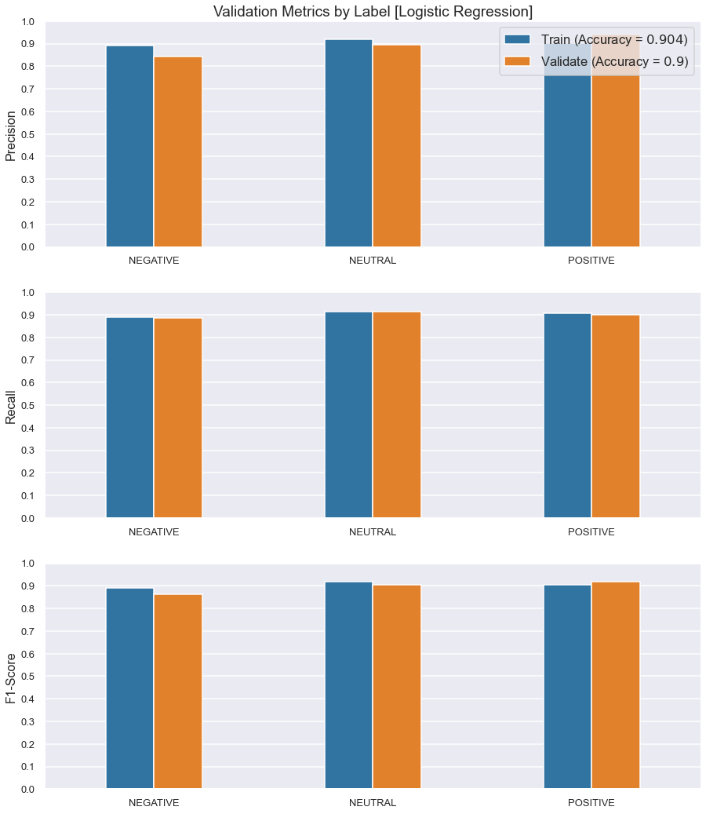
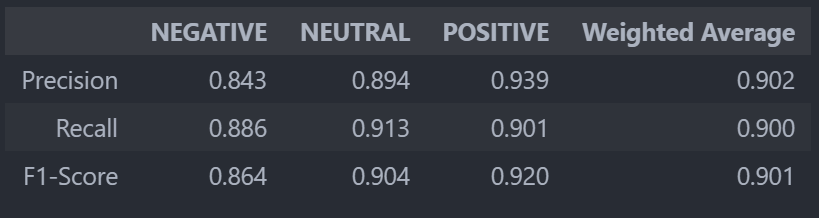
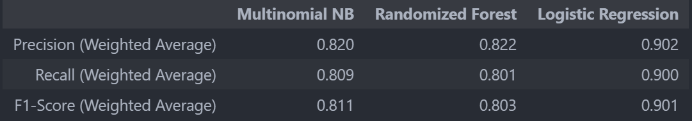

## Business Understanding

*Gallup*, a global analytics and advice firm, plans to conduct a large-scale survey regarding public sentiment towards the political parties in the United States. In order to achieve this, they require a model that can rate the sentiment of a Tweet based on its content. Once training of the model has been completed, it is to be deployed as a sentiment analysis tool for that recieves data from the Twitter API.

## Data Understanding

> *The [Sentiment140](http://help.sentiment140.com/home) dataset will be used to train the classification models. It is a collection of $1,600,000$ tweets, all of which are labelled with a corresponding value indicating sentiment.*

> __The dataset consists of 5 input features and 1 target variable:__
> * __id__ *[int] - unique identifier of the tweet*
> * __date__ *[str] - date the tweet was posted*
> * __user__ *[str] - user that posted the tweet*
> * __text__ *[str] - content of the tweet*
---
> * [Target Variable] __target__ *[str] - label indicating sentiment expressed in the tweet*
>   - __0__ - *negative*
>   - __4__ - *positive*


It is crucial to note that the data in *Sentiment140* is weakly labeled, that is, its labels were generated automatically based on some heuristic. In the technical paper associated with *Sentiment140*, *[Twitter Sentiment Classification using Distant Supervision](https://cs.stanford.edu/people/alecmgo/papers/TwitterDistantSupervision09.pdf)*, this process is summarized:

> "*With the large range of topics discussed on Twitter, it would be very difficult to manually collect enough data to train a sentiment classifier for tweets. Our solution is to use distant supervision, in which our training data consists of tweets with emoticons. The emoticons serve as noisy labels. For example, :) in a tweet indicate that the tweet contains positive sentiment and :( indicates that the tweet contains negative sentiment.*"

The heuristic outlined above was chosen to generate labels because it had previsiously been shown that emoticons have the potential of being independent of domain, time, and topic [refer to *[Using Emoticons to Reduce Dependency in Machine Learning Techniques for Sentiment Classification](https://aclanthology.org/P05-2008.pdf)* for more details]. At the time when *Sentiment140* was being compiled, this property made emoticons the ideal candidate for such a heuristic. Utilizing such a simple heuristic rule for classifying something as complex as sentiment is bound to produce a substantial number of incorrect labels. Fortunately, there now exists a better alternative to rule-based label generation.

> *__For this analysis, the original labels were discarded, and a new set of labels was generated using the VADER (Valence Aware Dictionary for sEntiment Reasoning) model.__*

> *VADER is a sentiment analysis engine that utilizes a parsimonious lexicon in conjunction with a rule-based model. The following features justify its use as a replacement for rule-based label generation:*
> - *the model relies on a lexicon that is specifically attuned to sentiment in microblog-like contexts (e.g. Twitter)*
> - *the model does not rely on statistical learning to make predictions and therefore does not require training data*
> - *the model is highly accurate -- experimental results show that it predicts the sentiment of tweets with an *F1 Classification Accuracy* of $0.96$ [refer to [VADER: A Parsimonious Rule-based Model for Sentiment Analysis of Social Media Text](http://comp.social.gatech.edu/papers/icwsm14.vader.hutto.pdf) for more details]*

In addition to obtaining more accurate labels, performing sentiment analysis with VADER allowed for the additional classification of tweets that express a neutral sentiment. Although tweets such as these were not considered during the construction of *Sentiment104*, the sheer number of tweets combined with the inaccuracy of the previous labeling method makes it likely that a significant number of neutral tweets are present in the dataset. Thus, for the sake of producing a finer classification model, tweets that were classified as neutral by VADER remained with this label throughout the remainder of this project.

## Data Processing

*An outline of the steps taken to process the textual data is shown below:*

> **1.** Cleaning

Cleaning the textual data was involved process which itself consisted of several steps.
*These steps are listed below:*

* Replacing accented characters
* Removing Twitter handles
* Removing Twitter Hashtags
* Removing web addresses
* Expanding contractions
* Removing non-alphabetical characters
* Expanding abbreviated words and phrases

> **2.** Tokenization

Tokenization was performed using the `TweetTokenizer` from the `nltk` module.

> **3.** Removal of Stop Words

Stop words were loaded from the corpus residing in the `nltk` module. It is important to note here , and so the stopwords `no` and `not` were left in the training data as features. The reason for this is that negation was deemed important with respect to analyzing sentiment when phrases, and not just words, are being considered (i.e creating tokens of $n$-grams with $n > 1$).

> **4.** Lemmatization

POS tagging was carried out on the tokenized corpus. These tagged tokens were then fed into the `WordNetLemmatizer` from the `nltk` module.

> **4.** Vectorization

Vectorization was performed on the fully processed corpus through by the `CountVectorizer` transformer from the `sklearn` module, creating a Bag of Words model of the corpus. Unigrams, bigrams, and trigrams were considered. To avoid an unnessecarily large number of features, the top $10,000$ tokens (in terms of corpus-wide frequency) were chosen for vectorization.


## Modeling

#### Scoring

Since over-representing sentiment (high false positive rate) and under-representing sentiment (high false negative rate) are both equally undesirable, the $F_1\text{-Score}$ was the primary metric by which models were evaluated. This score takes into account both recall and precision - if one of these metrics suffers, it will be reflected in the $F_1\text{-Score}$. The formula for the $F_1\text{-Score}$ is:
> $$ F_1 = 2(\dfrac{1}{R} + \dfrac{1}{P}) = 2(\dfrac{PR}{P+R})$$
> $ P = \text{precision} $
> $ R = \text{recall} $


#### Models

Sentiment classification was performed using the following models:
- **Multinomial Naive Bayes**
- **Randomized Forest**
- **Logistic Regression**


## Results

#### Multinomial Naive Bayes
> `MultinomialNB(alpha=0.01)`

*The validation metrics for the naive Bayes model are shown below:*


<center></center>
<br>
<center></center>
<br>

*Numerical scores of its performance on the validation set are shown in the table below:*
<center></center>

The validation metrics above indicate that:
> - **Good recall of POSITIVE tweets:**
>   - **$79\%$ labeled correctly**
> - **Excellent precision of POSITIVE tweets:**
>   - **only $5\%$ of NEUTRAL tweets incorrectly labeled as POSITIVE**
>   - **only $8\%$ of NEGATIVE tweets incorrectly labeled as POSITIVE**
> - **Good balance between recall and precision of the POSITIVE tweets $(F_1 = 0.849)$**
---
> - **Very good recall of NEUTRAL tweets:**
>   - **$84\%$ labeled correctly**
> - **Decent precision of NEUTRAL tweets:**
>   - **$12\%$ of NEGATIVE  tweets incorrectly labeled as NEUTRAL**
>   - **$10\%$ of POSITIVE tweets incorrectly labeled as NEUTRAL**
> - **Excellent balance between recall and precision of the NEUTRAL tweets $(F_1 = 0.904)$**
---
> - **Good recall of NEGATIVE tweets:**
>   - **$80\%$ labeled correctly**
> - **Decent precision of NEGATIVE tweets:**
>   - **$11\%$ of NEUTRAL  tweets incorrectly labeled as NEGATIVE**
>   - **$11\%$ of POSITIVE tweets incorrectly labeled as NEGATIVE**
> - **Decent balance between recall and precision of the NEGATIVE tweets $(F_1 = 0.759)$**
---
> - **The model generalizes well to the training data (overfitting has not occured)**
#### Randomized Forest
> `RandomForestClassifier(class_weight='balanced', max_depth=60, n_jobs=-1, random_state=0)`

*The validation metrics for the randomized forest model are shown below:*


<center></center>
<br>
<center></center>
<br>

*Numerical scores of its performance on the validation set are shown in the table below:*
<center></center>

The validation metrics above indicate that:

> - **Good recall of POSITIVE tweets:**
>   - **$79\%$ labeled correctly**
> - **Excellent precision of POSITIVE tweets:**
>   - **only $5\%$ of NEUTRAL tweets incorrectly labeled as POSITIVE**
>   - **only $8\%$ of NEGATIVE tweets incorrectly labeled as POSITIVE**
> - **Good balance between recall and precision of the POSITIVE tweets $(F_1 = 0.846)$**
---
> - **Excellent recall of NEUTRAL tweets:**
>   - **$93\%$ labeled correctly**
> - **However, very poor precision of NEUTRAL tweets:**
>   - **$15\%$ of POSITIVE tweets incorrectly labeled as NEUTRAL**
>   - **$21\%$ of NEGATIVE tweets incorrectly labeled as NEUTRAL**
> - **Decent balance between recall and precision of the NEUTRAL tweets $(F_1 = 0.783)$**

---
> - **Poor recall of NEGATIVE tweets - only $69\%$ labeled correctly**
> - **Decent precision of NEGATIVE tweets:**
>   - **$11\%$ of NEUTRAL  tweets incorrectly labeled as NEGATIVE**
>   - **$11\%$ of POSITIVE tweets incorrectly labeled as NEGATIVE**
> - **Decent balance between recall and precision of the NEGATIVE tweets $(F_1 = 0.759)$**
---
> - **The model generalizes fairly well to the validation data, but a $0.20$ loss in accuracy indicates some overfitting occured**


#### Logistic Regression
> `LogisticRegression(class_weight='balanced', max_iter=10000, multi_class='multinomial', n_jobs=-1, random_state=0, solver='saga')`

*The validation metrics for the logistic regression model are shown below:*


<center></center>
<br>
<center></center>
<br>

*Numerical scores of its performance on the validation set are shown in the table below:*
<center></center>

The validation metrics above indicate that:
> - **Excellent recall of POSITIVE tweets:**
>   - **$90\%$ labeled correctly**
> - **Excellent precision of POSITIVE tweets:**
>   - **only $4\%$ of NEUTRAL tweets incorrectly labeled as POSITIVE**
>   - **only $7\%$ of NEGATIVE tweets incorrectly labeled as POSITIVE**
> - **Excellent balance between recall and precision of the POSITIVE tweets $(F_1 = 0.920)$**
---
> - **Excellent recall of NEUTRAL tweets:**
>   - **$91\%$ labeled correctly**
> - **Excellent precision of NEUTRAL tweets:**
>   - **$5\%$ of NEGATIVE  tweets incorrectly labeled as NEUTRAL**
>   - **$4\%$ of POSITIVE tweets incorrectly labeled as NEUTRAL**
> - **Excellent balance between recall and precision of the NEUTRAL tweets $(F_1 = 0.904)$**
---
> - **Excellent recall of NEGATIVE tweets:**
>   - **$89\%$ labeled correctly**
> - **Very good precision of NEGATIVE tweets:**
>   - **$5\%$ of NEUTRAL  tweets incorrectly labeled as NEGATIVE**
>   - **$6\%$ of POSITIVE tweets incorrectly labeled as NEGATIVE**
> - **Very good balance between recall and precision of the NEGATIVE tweets $(F_1 = 0.864)$**
---
> - **The model generalizes well to the training data (overfitting has not occured)**

## Conclusion

*Average scores on the validation set are shown for each model in the table below:*
<center></center>

The table above indicates that the Logistic Regression model is superior to the other two models, with the highest average precision, recall, and $F_1\text{-score}$.

## Limitations & Future Work

#### Fine-Grained Sentiment Analysis

Polarity can be categorized with greater precision. In the realm of politics, the degree of polarization is as important as polarity itself. As an example, consider the benefit of being able to use sentiment analysis to discern between hardline Republicans/Democrats versus their more moderate counterparts. Therefore it would be prudent to expand the categories of polarity. For example, a model could be trained to classify sentiment under the following polarities:
- *Very Positive*
- *Positive*
- *Neutral*
- *Negative*
- *Very Negative*

The upside of this approach is that powerful rule-based sentiment analyzers (e.g. VADER) are readily available for use in generating weakly-labeled data with finer grain polarity.

#### Emotion Detection

Sentiment can also be categorized with greater precision. A better approach to surveying public sentiment would be to train a model to detect the emotions, rather than the general sentiment, expressed in a tweet. With respect to the political arena, this would provide invaluable information because it would allow trends in sentiment to be broken

The downside of using natural language processing to classify emotions is that the meaning of individual words/phrases becomes more context-specific, and therefore, harder to classify. For example, some words that typically express anger, like "*bad*" or "*kill*", in one context (e.g. "*your product is so bad*" or "*your customer support is killing me*")  might also express happiness in some other context (e.g. "*this is bad ass*" or "*you're killing it*").

#### Identification of Domain-Specific Tweets

Training a model to classify the sentiment of tweets, without regarding topic, results in the model having to utilize a very large vocabulary. If limited to a particular domain (American politics in this case), it is likely the model will perform better. Therefore, more emphasis needs to be placed on gathering tweets with content related to American politics. Alternatively, a separate model can be trained to specifically identify such tweets.

#### Utilizing Emoticon Data

As discussed in *Part B*, the tweets that comprise the *Sentiment104* dataset had their emoticons stripped from them before being incorporated into the dataset. This leads to a signiicant shortcoming in our model, namely, that it does not account for emoticons when determining sentiment. This needs to be addressed because the emoticon feature is very informative when it comes to sentiment, especially with regard to Twitter data. This can easily be achieved by collecting a new set of tweets from the Twitter API, and adjusting text pre-processing such that emoticons are identified and kept as tokens before special characters are removed in general.

## Further Information

Review the full analysis in the [ Jupyter Notebook](./predicting-cardiovascular-disease.ipynb) or the view the [Presentation](./Predicting_Cardiovascular_Disease_Presentation.pdf).

*For any additional questions, please contact:*

> **Suleyman Qayum (sqayum33@gmail.com)**


## Repository Structure
```
├── data
    └── sentiment140.zip
├── images
    ├── logreg-confusion-matrices.png
    ├── logreg-metrics-df.png
    ├── logreg-validation-metrics.png
    ├── mnb-confusion-matrices.png
    ├── mnb-metrics-df.png
    ├── mnb-validation-metrics.png
    ├── overall-metrics.png
    ├── rfc-confusion-matrices.png
    ├── rfc-metrics-df.png
    ├── rfc-validation-curve.png
    └── rfc-validation-metrics.png
├── nlp_utils.py
├── Twitter_Sentiment_Analysis.pdf
├── twitter-sentiment-analysis.ipynb
└── README.md
```
